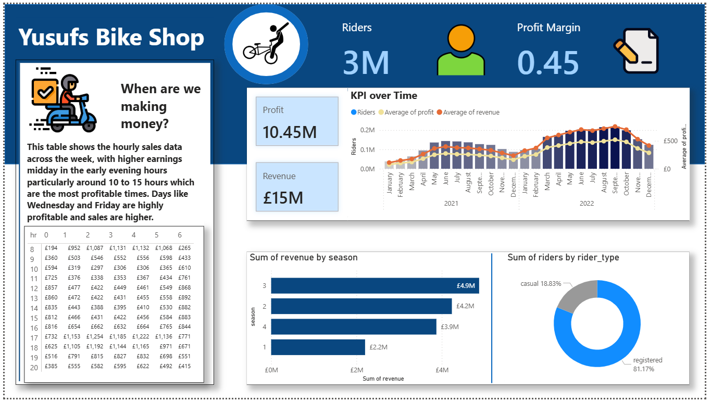

### Workflow

1. **Built a Database**  
   Structured and organized the raw data into a relational format suitable for analysis.

2. **Developed SQL Queries**  
   Extracted key insights using custom queries focused on usage patterns, customer segments, and financial performance.

3. **Connected Power BI to the Database**  
   Enabled direct querying and real-time data exploration within Power BI.

4. **Built an Interactive Dashboard**  
   Designed and implemented a comprehensive dashboard to highlight major findings and support strategic decision-making.

5. **Delivered Analysis-Based Recommendations**  
   Provided a recommendation on whether a price increase is appropriate, based on customer behavior, usage trends, and financial data.

### Repository Contents

- Power BI Dashboard file (`.pbix`)
- SQL queries (`.sql`)

### How to Open the Power BI Project

1. Ensure you have [Power BI Desktop](https://powerbi.microsoft.com/desktop/) installed on your computer.
2. Download or clone this repository to your local machine.
3. Open Power BI Desktop.
4. Click **File** → **Open** and navigate to the `.pbix` file included in this repository.
5. Open the file to view and interact with the dashboard.
6. To refresh data, ensure your database is accessible and configured correctly for live querying.

### Dashboard Preview

